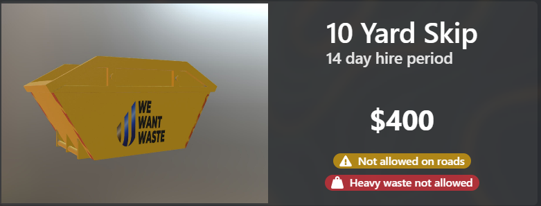
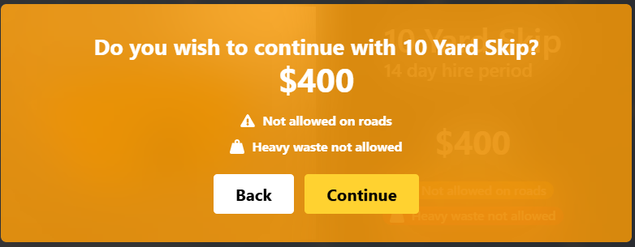
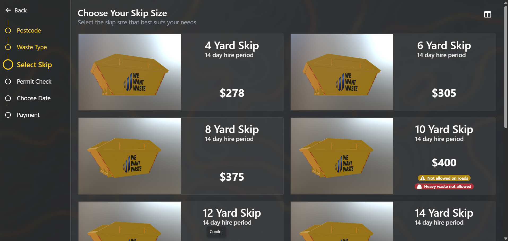
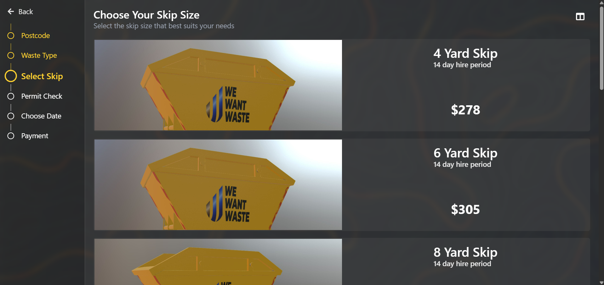
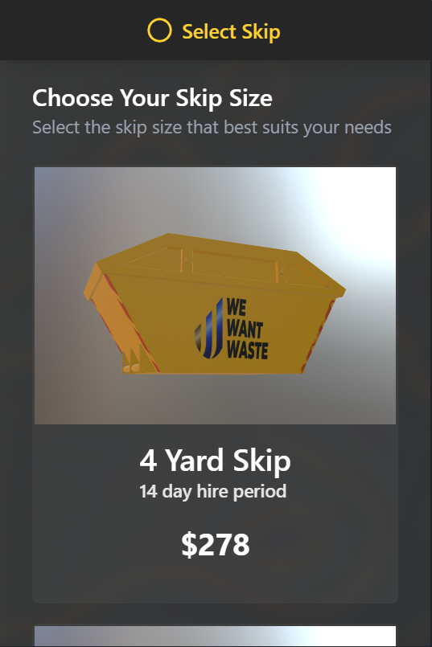

# React Coding Challenge – Select Skip Page Redesign

Welcome to the React coding challenge of redesigning one of the pages (Select Skip) at [wewantwaste.co.uk](https://wewantwaste.co.uk).

## 🛠 Tech Stack Used

- **React.js (Vite)**
- **TailwindCSS** – Styling
- **TanStack Query** – Data fetching and state management

## 📝 Page Description

The **Select Skip** page gives the user the ability to select a suitable skip from the available options depending on their location, amount of waste to be transferred, and weight.

This coding exercise required a redesign of the Select Skip page. Below are the changes implemented from the original design.

## 🔧 Changes

### 💡 Layout

- The page layout is divided into:
  - A **sidebar** on the left to represent the process sequence
  - A **main viewport** to display skip options to the user

### 📚 Sidebar

- Comprises a list of steps referring to other pages (navigation not implemented here)
- Uses `react-icons` for a clean UI/UX alongside page names
- Changed layout from **top to left** and color from **blue to amber**

### 🖥Main Viewport

- **Header:** Displays the page title, description, and a _Change View_ button
- **Main Section:** Shows skip options depending on user address
  - Responsive grid layout
  - Sleek cards for skip details
  - Spinner to load the data

### 🧾 Card Component

- Large screens show:
  - Skip image on the left
  - Info on the right
- Minimal design with:
  - Blurred background
  - Updated color scheme
  - Border and button redesign
    

### ⚠️ Warning Component

- Tracks skip conditions:
  - Allowed on roads
  - Allows heavy waste
- Compact, intuitive visual feedback with colored indicators

### 🆙 SlideUpPanel Component

- Activated when a card is clicked
- Contains:
  - Confirmation message
  - Warning info
  - Back & Continue buttons
- UX-focused design with smoother visuals
  

### 🚫 Forbidden Component

- Blurs or greys out inaccessible options based on criteria

### ❗ ErrorAlert Component

- Handles request failures
- Minimalist alert display for user feedback

### Screenshots

---

## 📁 Project Folder Structure

├── APILogic/

│ └── useSkips.js # Custom hooks to fetch data from the server

│

├── Components/

│ ├── Card.jsx # Skip display card

│ ├── SlideUpPanel.jsx # Confirmation panel inside card

│ ├── Warning.jsx # Displays warnings

│ ├── Forbidden.jsx # Handles inaccessible skips

│ └── ErrorAlert.jsx # Displays API errors

│

├── Pages/

│ └── Select_Skip.jsx # Main redesigned Select Skip page

│

├── vite.config.js # Vite configuration

└── README.md # Project documentation

---
